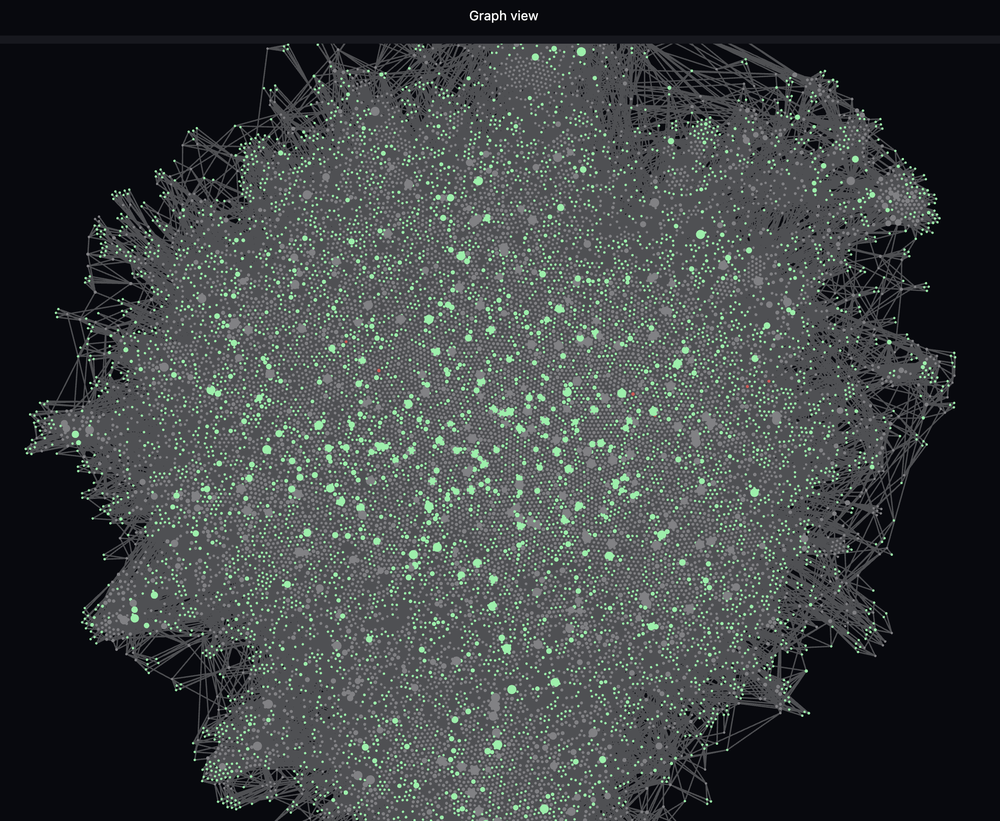

# ZettelVault

[](https://github.com/RamXX/zettelvault/actions/workflows/ci.yml)
[](https://www.python.org/downloads/)
[](LICENSE)
[](https://github.com/astral-sh/ruff)

Transform a messy [Obsidian](https://obsidian.md/) vault into clean **PARA + Zettelkasten** structure using LLMs.

Most knowledge workers accumulate hundreds of notes in Obsidian over time, but the vault gradually becomes a tangled mess of long-form drafts, bullet dumps, and half-finished thoughts. ZettelVault fixes that. It reads every note from one or more source vaults, classifies each into the [PARA](https://fortelabs.com/blog/para/) method (Projects / Areas / Resources / Archive), then decomposes each note into atomic [Zettelkasten](https://en.wikipedia.org/wiki/Zettelkasten) notes - one idea per note, heavily cross-linked. Under the hood, it uses [DSPy](https://github.com/stanfordnlp/dspy) for structured LLM interaction, with [dspy.RLM](https://dspy.ai/api/modules/RLM) (Recursive Language Models) as the primary decomposition strategy.

Beyond vault restructuring, this project also serves as **reference code for using dspy.RLM for document decomposition** - a technique applicable to any use case where long-form documents need to be split into structured, atomic units.



## Table of Contents

- [Pipeline](#pipeline)
- [RLM vs Predict/ChainOfThought](#rlm-vs-predictchainofthought)
- [Model Comparison](#model-comparison)
- [Production Run (GLM-5)](#production-run-glm-5)
- [Cost Tracking](#cost-tracking)
- [Design Decisions](#design-decisions)
- [Known Limitations](#known-limitations)
- [Setup](#setup)
- [Usage](#usage)
- [Testing](#testing)
- [Project Structure](#project-structure)
- [Potential Improvements](#potential-improvements)
- [References](#references)

## Pipeline

The pipeline has five steps, each feeding into the next. The diagram below shows the overall flow, and the sections that follow explain each step in detail.

```
Source Vault(s)                                          Destination Vault
+------------------+                                      +--------------------+
| Note A (messy)   |    1. Read     2. Classify           | 1. Projects/       |
| Note B (messy)   | ---------> [PARA bucket] -------->   |    TopicA/         |
| Note C (messy)   |            [domain/tags]     |       |      Atomic Note 1 |
| ...              |                              |       |      Atomic Note 2 |
+------------------+            3. Decompose      |       | 2. Areas/          |
                                [RLM -> REPL]     |       |    TopicB/         |
                                [code analysis]   |       |      Atomic Note 3 |
                                [sub-LM calls]    |       | 3. Resources/      |
                                      |           |       |    TopicC/         |
                            4. Write  |           |       |      Atomic Note 4 |
                            ----------+---------->|       | 4. Archive/        |
                            5. Resolve links      |       | MOC/               |
                                      +---------->|       |   Domain-A.md      |
                                                          |   Domain-B.md      |
                                                          +--------------------+
```

### Step 1: Read

The first thing ZettelVault needs to do is read every `.md` file from one or more source vaults. Rather than walking the filesystem and manually parsing Obsidian's internal structures, ZettelVault delegates this to [`vlt`](https://github.com/RamXX/vlt).

#### Why vlt

vlt is a fast, zero-dependency CLI tool (a compiled Go binary) purpose-built for operating on Obsidian vaults without requiring the Obsidian desktop app, Electron, Node.js, or any network calls. It reads and writes vault files directly via the filesystem, starts in sub-millisecond time by leveraging the OS page cache, and uses advisory file locking for safe concurrent access.

ZettelVault uses vlt instead of reading files directly for several reasons:

- **Vault registry awareness.** vlt understands Obsidian's vault registry, so vault names map to filesystem paths automatically. You pass a vault name, not a directory path.
- **Native Obsidian parsing.** Frontmatter extraction, wikilink resolution, and tag parsing are handled natively by vlt, so ZettelVault does not need to reimplement any of that logic.
- **Multi-vault support.** Working with multiple source vaults is trivial - just pass vault names and vlt handles the rest.
- **Structured output.** vlt produces JSON output suitable for pipeline consumption, making it easy to integrate with Python scripts.
- **No internal configuration parsing.** There is no need to understand or parse Obsidian's `.obsidian/` directory structure.

Multiple source vaults are supported: pass space-separated vault names and ZettelVault merges them (first vault wins on title collision). No Obsidian desktop app is required for processing, but it is recommended for viewing results.

### Step 2: Classify (dspy.Predict)

Once all notes are loaded, ZettelVault classifies each one into the PARA framework. This gives every note a clear place in the output vault's folder hierarchy. Each note receives:

- **PARA bucket**: Projects, Areas, Resources, or Archive
- **Domain**: a primary knowledge domain (e.g., "AI/ML", "Engineering", "Health")
- **Subdomain**: a specific area within the domain (e.g., "DSPy", "Networking", "Nutrition")
- **Tags**: 3-7 lowercase hyphenated tags

The classification uses a typed DSPy `Signature` with `Literal` type for PARA buckets, ensuring the model always produces a valid category.

Classification results are cached to `classified_notes.json` after every 50 notes for crash resilience. If the cache exists on a subsequent run, only new (uncached) notes are classified.

### Step 3: Decompose (dspy.RLM with fallback)

This is the heart of the pipeline. Each classified note is decomposed into atomic Zettelkasten notes, where "atomic" means one idea per note, heavily cross-linked to its siblings. To make this reliable, ZettelVault uses a **three-level fallback strategy**:

1. **dspy.RLM** (primary) - the model writes Python code in a sandboxed REPL to programmatically analyze the note's structure, then generates atomic notes
2. **dspy.Predict with retry** - direct LLM call with escalating temperature (0.1, 0.4, 0.7) and cache bypass
3. **Single-atom passthrough** - guaranteed success; emits the original note as-is

Before decomposition begins, a **concept index** maps meaningful words to note titles, enabling cross-link suggestions. Each note receives a list of the most conceptually similar note titles as context, so the LLM can generate relevant wikilinks.

The output format uses `===`-delimited markdown blocks (not JSON - see [Design Decisions](#why-markdown-over-json) for why).

Notes that fall back to Predict or passthrough are logged to `fallback_notes.json` with the note title, reason, and atom count. This log can be used to selectively reprocess those notes later (see `make reprocess`).

Decomposition results are checkpointed to `atomic_notes.json` after every note. If the cache exists on a subsequent run, already-decomposed notes (matched by source title) are skipped automatically, enabling progressive processing across multiple sessions.

### Step 4: Write

With classification and decomposition complete, ZettelVault writes the atomic notes to the destination vault. Each note gets:

- YAML frontmatter (tags, domain, subdomain, source note, type)
- Non-conflicting original frontmatter fields preserved (aliases, cssclass, plugin-specific fields)
- Markdown body with `# Title` heading
- `## Related` section with `[[wikilinks]]` to related notes
- Files organized into `PARA_bucket/Subdomain/Title.md`
- Collision handling: duplicate filenames get a `_1`, `_2`, etc. suffix

A Map of Content (MOC) note per domain is generated in `MOC/`, containing `[[wikilinks]]` to all atomic notes in that domain. These MOC notes serve as navigational hubs once you open the vault in Obsidian.

The `.obsidian` configuration directory from the first source vault is copied to the destination (if it does not already exist), so plugins, themes, and settings carry over.

### Step 5: Resolve Links

The final step cleans up the link graph. During decomposition, the LLM generates wikilinks to related notes, but not all of those targets actually exist in the output vault. ZettelVault scans the destination vault and resolves orphan `[[wikilinks]]` - links that point to notes that do not exist - using a four-tier strategy:

1. **Case-insensitive match**: `[[project planning]]` resolves to `Project Planning.md`
2. **Fuzzy match**: `[[Proj Planning]]` resolves to `Project Planning.md` if the similarity ratio is >= 0.85 (uses `difflib.SequenceMatcher`)
3. **Stub creation**: orphan links referenced by 3+ notes get a stub note created in the most common PARA folder among referencing notes, with a "Referenced by" section
4. **Dead link removal**: orphan links with only 1-2 references are stripped of brackets (converted to plain text)

The result is a clean, navigable link graph with no dangling references.

## RLM vs Predict/ChainOfThought

The key insight behind this project is that **document decomposition benefits enormously from programmatic analysis**. Traditional `dspy.Predict` or `dspy.ChainOfThought` feed the entire document into the LLM's context window and ask it to generate decomposed output in a single pass. `dspy.RLM` takes a fundamentally different approach: **the document content is never loaded into the LLM's primary context**. Instead, it is stored as a variable (`context`) inside a sandboxed REPL environment, and the LLM writes Python code to access and process it programmatically.

This distinction matters: the LLM's context window is used for *reasoning and code generation*, not for holding the document. The document lives in the execution environment as data, accessible via code. This means RLM can handle documents far larger than the model's context window - the model only ever sees the slices it explicitly reads via code.

### How RLM Works

When decomposing a note, the RLM module:

1. Stores the note content in a `context` variable inside a Deno/Pyodide WASM sandbox - **not** in the LLM's prompt
2. The LLM writes Python code to access `context` and analyze the note's structure (headings, bullet points, paragraphs)
3. The code executes in the sandbox; output is captured and shown to the LLM
4. The LLM iterates - writing more code to refine its analysis, split content, generate titles and tags
5. For semantic tasks, the LLM calls `llm_query()` from within the sandbox (e.g., "what is the main idea of this paragraph?")
6. When done, the LLM calls `SUBMIT(decomposed=...)` to return the final result

Because the document is data in the REPL rather than tokens in the prompt, the model can:
- Process documents of arbitrary length (500K+ characters) without context window pressure
- Count sections and bullet points programmatically
- Split content at structural boundaries with precision
- Use regex to extract patterns (tags, links, metadata)
- Make sub-LM calls for semantic understanding of specific sections
- Self-correct by inspecting intermediate results

### Performance Comparison

To quantify the difference, we tested both approaches on 4 source notes from an Obsidian vault, using `qwen/qwen3.5-35b-a3b` via OpenRouter (Parasail provider):

| Metric | dspy.Predict | dspy.RLM |
|--------|-------------|----------|
| Atomic notes produced | 17 | 23 |
| Notes with fallback | 1 (25%) | 0 (0%) |
| Success rate | 75% (3/4) | 100% (4/4) |
| Avg iterations per note | n/a | 5.5 |
| Sub-LM calls (total) | n/a | 3 |
| Provider-reported cost | ~$0.04 | ~$0.08 |
| Latency per note | ~5s | ~30s |

Key findings:

- **RLM solved the deterministic failure case.** A bullet-heavy note always failed with Predict across all temperatures (0.1 to 0.7) and retry counts. RLM decomposed it successfully on the first attempt by writing code to iterate over bullet points.
- **RLM produces more atomic notes.** 23 vs 17 - RLM splits more aggressively because it can programmatically identify section boundaries.
- **RLM generates richer cross-links.** The REPL allows the model to compare note content against the related titles list programmatically.
- **Cost is 2x but still very low.** At \$0.08 for 4 notes, the cost per note is ~$0.02 with RLM. For vault restructuring (a batch operation run once), this is negligible.

### When to Use RLM vs Predict

| Use Case | Recommendation |
|----------|---------------|
| Structured documents (headings, lists) | RLM - programmatic splitting is more reliable |
| Short, simple notes (1-2 paragraphs) | Predict - RLM overhead isn't justified |
| Notes with complex cross-references | RLM - can programmatically match against related titles |
| High-volume batch processing (1000+ notes) | RLM with cost monitoring - 2x cost may matter at scale |
| Real-time / interactive use | Predict - 5s vs 30s latency matters for UX |
| Notes that consistently fail with Predict | RLM - its code-based approach bypasses template collisions |

### Why RLM Over ChainOfThought

`dspy.ChainOfThought` adds a reasoning step before output generation. For decomposition tasks, this reasoning competes with the actual output for the model's output token budget - the model spends tokens planning *what* it will do rather than *doing* it. Whether this trade-off helps depends on the task and model; we chose not to use it for decomposition because the reasoning step doesn't produce actionable intermediate results the model can inspect or correct.

RLM is architecturally different - it doesn't add reasoning text, it adds *execution*. The model writes code that runs, producing concrete intermediate results it can inspect and refine. Each REPL iteration is a feedback loop, not a one-shot preamble.

## Model Comparison

Choosing the right model matters. We tested multiple open-source models as RLM orchestrators across two dimensions: **quantitative metrics** (cost, speed, convergence) and **qualitative assessment** (output quality, content fidelity, link richness). All tests used the same 4 source notes, run via [OpenRouter](https://openrouter.ai).

These results reflect only the models we tested during the evaluation phase. Our focus during evaluation was on open-source models because many users want to run this locally via [LM Studio](https://lmstudio.ai/), [Ollama](https://ollama.com/), or similar tools. After evaluation, we selected GLM-5 for the production run on our full vault (see [Production Run (GLM-5)](#production-run-glm-5)).

### Quantitative Results (Evaluation, 4 Test Notes)

| Metric | Qwen 3.5-35B-A3B | MiniMax M2.5 | Kimi K2.5 |
|--------|------------------|--------------|-----------|
| Atomic notes | 23 | 16 | 18 |
| RLM iterations | 21 (5.2 avg) | 17 (4.2 avg) | 15 (3.8 avg) |
| Sub-LM calls | 2 | 3 | 0 |
| LLM calls | 33 | 22 | 20 |
| Input tokens | 19K | 48K | 37K |
| Output tokens | 33K | 13K | 10K |
| Provider cost | $0.080 | $0.033 | $0.051 |
| Max iters hit | 0 | 0 | 0 |

### Qualitative Assessment (Evaluation, 4 Test Notes)

Numbers only tell part of the story. We manually reviewed every atom produced by each model, comparing against the source notes for content fidelity, duplication, granularity, and cross-linking quality.

| Dimension | Qwen 3.5-35B-A3B | MiniMax M2.5 | Kimi K2.5 |
|---|---|---|---|
| Content preservation | Good - uses original phrasing | Poor - invents/paraphrases | **Best** - verbatim + source attribution |
| Content duplication | Near-duplicate atom pairs | Verbatim duplicate atoms | **Zero duplicates** |
| Granularity judgment | Over-splits (1 paragraph -> 7 atoms) | Mixed | Slightly over-splits (1 paragraph -> 4 atoms) |
| Cross-linking | Basic (links to source notes only) | Basic | **Rich** (links between sibling atoms + source notes) |
| Source attribution | None | None | **Includes "From:" and "See also:" references** |

**Kimi K2.5 is the quality winner** among the models we evaluated. It produces the most faithful content extraction with zero duplicates, the richest cross-link graph (it creates links between sibling atoms within the same source note, not just back to source notes), and proper source attribution. It also converges fastest (3.8 avg iterations) with the fewest total LLM calls.

Qwen 3.5-35B-A3B is a solid baseline that preserves original text well but over-splits aggressively - it will fragment a single paragraph into many single-sentence atoms, destroying the paragraph's coherence. MiniMax M2.5 converges fast and is the cheapest, but produces duplicate content and invents text not present in the source.

Kimi K2.5's strong showing during evaluation set the quality ceiling, and this informed our final model choice for the production run. See the next section for how GLM-5 performed at full vault scale.

### Sub-LM Comparison (Qwen orchestrator, varying sub-LM)

We also tested different sub-LM models for `llm_query()` calls while keeping Qwen as the orchestrator:

| Metric | Same model | Liquid LFM-2 | Qwen Flash | Mercury-2 | Step-3.5-Flash |
|--------|-----------|--------------|------------|-----------|----------------|
| Atomic notes | 24 | 19 | 23 | 21 | 21 |
| RLM iterations | 26 (6.5 avg) | 23 (5.8 avg) | 42 (10.5 avg) | 42 (10.5 avg) | 42 (10.5 avg) |
| Sub-LM calls | 9 | 2 | 2 | 2 | 2 |
| Provider cost | $0.094 | $0.051 | $0.111 | $0.116 | $0.125 |
| Max iters hit | 0 | 0 | 2 | 2 | 2 |

The sub-LM currently has minimal influence - the orchestrator makes very few `llm_query()` calls (2-9 across 4 notes). A signature or prompt change that encourages more sub-LM usage could shift the economics of dual-model setups.

### Notes on Reasoning Models

Some models (Kimi K2.5, DeepSeek R1, etc.) default to "thinking mode" where tokens go to an internal reasoning trace before producing content. This can cause DSPy to hang indefinitely - the model burns its token budget on reasoning and never emits content.

**Fix for Kimi K2.5:** Disable reasoning and use `XMLAdapter` (which matches Kimi's post-training format):

```yaml
# config.local.yaml
model:
  id: "moonshotai/kimi-k2.5"
  provider: "openrouter"
  max_tokens: 32000
  adapter: "xml"
  reasoning:
    enabled: false
```

The `reasoning` config maps directly to OpenRouter's `reasoning` parameter in the request body. For Qwen 3.5, thinking mode doesn't cause issues because it returns reasoning within the `content` field rather than a separate `reasoning` field.

## Production Run (GLM-5)

After evaluating Qwen, MiniMax, and Kimi K2.5 on 4 test notes, we chose [GLM-5](https://open.bigmodel.cn/) from Zhipu AI for the full production run. GLM-5 was accessed via [z.ai](https://z.ai/)'s OpenAI-compatible API endpoint, not through OpenRouter.

Two factors drove this decision. First, GLM-5's code generation capabilities proved strong enough for RLM's REPL-driven decomposition, matching the quality ceiling that Kimi K2.5 had established during evaluation. Second, z.ai's API endpoint is OpenAI-compatible, so no code changes were needed, just a config override pointing `api_base` at z.ai and setting the model ID.

### Full Vault Results

The production run processed a real vault of **774 notes** (merged from two source vaults containing 671 and 103 notes respectively), producing **5,805 atomic notes**. Here are the key metrics:

| Metric | GLM-5 (Production) |
|--------|---------------------|
| Source notes | 774 |
| Atomic notes produced | 5,805 |
| Total REPL iterations | 3,981 (5.2 avg per note) |
| Sub-LM calls | 839 |
| Fallback to dspy.Predict | 35 / 769 (4.6%) |
| Runtime | ~51 hours |
| Provider cost | $0.00 (see note below) |

The 4.6% fallback rate means that 35 out of 769 notes (a few notes were filtered or deduplicated during merging) fell back from RLM to dspy.Predict. Notably, every one of those 35 fallback notes produced results that required no manual adjustment. This validates the three-level fallback strategy: even when RLM fails, Predict picks up the slack cleanly.

**On cost:** The cost report shows $0 because the author has a yearly subscription to z.ai at a fixed price, making the marginal cost of running GLM-5 effectively zero. If you use z.ai's API directly without a subscription, you will incur whatever per-token costs Zhipu charges. The cost tracker itself has no pricing data for z.ai (it is not in OpenRouter's model catalog), so it cannot calculate costs for this endpoint automatically.

### Comparison to Evaluation

It is worth noting that the evaluation data (Qwen, MiniMax, Kimi K2.5) used only 4 test notes, while the GLM-5 numbers come from the full 774-note vault. The evaluation was designed to compare model quality and choose a winner; the production run was designed to process everything. The 5.2 average REPL iterations per note in production aligns closely with the evaluation results (3.8 to 6.5 range), suggesting that the evaluation was representative of real-world behavior.

### Local Alternative: Qwen 3.5

Although GLM-5 was excellent for the production run, Qwen 3.5-35B-A3B is a very strong contender for running the entire pipeline locally. An [MLX version](https://huggingface.co/mlx-community) is available for Mac, making it practical to process a full vault without any API costs at all. For users who want full control and privacy, this is worth considering. Qwen performed well during evaluation (see [Model Comparison](#model-comparison)), and running it locally eliminates both cost and rate-limiting concerns.

## Cost Tracking

ZettelVault includes a standalone cost tracking module (`pricing.py`) that:

1. **Fetches real-time pricing** from OpenRouter's `/api/v1/models` catalog at startup
2. **Tracks token usage per pipeline phase** by inspecting DSPy's `lm.history`
3. **Reports both calculated and provider-reported costs** for accuracy

### Sample Cost Report

```
======================================================================
COST REPORT: Qwen3.5-35B-A3B
Model: qwen/qwen3.5-35b-a3b
Pricing: $0.1625/M input, $1.3000/M output
Context window: 262,144 tokens
======================================================================
Phase                      Calls      Input     Output         Cost
----------------------------------------------------------------------
classification                 4      8,234      1,102    $0.002768
decomposition                  8     45,123     12,456    $0.023526  [22 iters, 3 sub]
----------------------------------------------------------------------
TOTAL                         12     53,357     13,558    $0.026294
TOTAL (provider)                                          $0.082341
======================================================================
```

The "provider" total reflects OpenRouter's actual billing, which includes routing costs and provider markup. It is more accurate than the calculated total, which uses catalog pricing.

### Cost Tracking Architecture

```python
from pricing import CostTracker

tracker = CostTracker("qwen/qwen3.5-35b-a3b")

with tracker.phase("classification"):
    for note in notes:
        classify(note)

with tracker.phase("decomposition") as phase:
    decompose_all(notes)
    phase.rlm_iterations = total_iters   # optional RLM metrics
    phase.rlm_sub_calls = total_subs

tracker.report()
```

The tracker works by snapshotting `lm.history` length before each phase and summing token counts from new entries after. DSPy stores usage data in two places per history entry:
- `entry["usage"]` - dict with `prompt_tokens`, `completion_tokens`
- `entry["response"].usage` - LiteLLM ModelResponse object

The tracker checks both, preferring the dict. It also sums `entry["cost"]` (LiteLLM's per-call cost) for the provider-reported total.

**Known limitation:** In our tests, the provider-reported cost (summed from `entry["cost"]`) was consistently higher than the cost we calculated from token counts. The exact cause of this delta is unclear - it may be due to DSPy internal retries, adapter overhead, or provider-side billing differences. We recommend treating the provider-reported total as the ground truth for actual spend, and the per-phase calculated values as useful for relative comparison between phases.

## Design Decisions

Several design choices in ZettelVault are non-obvious and worth explaining. Each one was made after encountering a specific failure mode during development.

### Why Markdown Over JSON

The decomposition output uses `===`-delimited markdown blocks rather than JSON:

```
Title: Atomic Note Title
Tags: tag1, tag2, tag3
Links: Related Note A, Related Note B
Body:
The actual content of this atomic note...

===

Title: Another Note
...
```

JSON output failed consistently because:
- Models generate trailing commas, unescaped quotes, and invalid unicode
- Large outputs exceed the model's ability to maintain valid JSON structure
- Error recovery requires reparsing the entire output

Markdown-delimited output is forgiving: each section is parsed independently, malformed sections are skipped, and the regex parser handles model quirks (concatenated hashtags, bracket-wrapped links, `.md` extensions).

### Preserving Wikilinks and Frontmatter

Obsidian notes have two structural elements that must survive the pipeline intact:

1. **Wikilinks** (`[[note title]]`) - the author's link graph. DSPy's template system uses `[[ ## field ## ]]` markers that collide with wikilink syntax. Stripping them would destroy the vault's cross-references.

2. **YAML frontmatter** - metadata used by Obsidian plugins (Dataview, Templater, etc.). Properties like `aliases`, `cssclass`, `publish`, and custom plugin fields must not be discarded.

**Wikilinks** are escaped to Unicode guillemets (`\u00ab` / `\u00bb`) before sending to DSPy, and restored to `[[brackets]]` after parsing output. The roundtrip is lossless, including edge cases like `[[Note (2024)]]` and `[[link|alias]]`.

**Frontmatter** is extracted from the source note before sanitization via `extract_frontmatter()`, carried through the pipeline alongside classification data, and merged into each atomic note's output. Generated fields (`tags`, `domain`, `subdomain`, `source`, `type`) take precedence; all other original properties are preserved as-is.

### Three-Level Fallback

Reliability matters more than perfection when processing hundreds of notes in a batch. The fallback chain (RLM -> Predict with retry -> passthrough) ensures the pipeline never fails:

- **RLM** handles complex, structured notes with high fidelity
- **Predict with retry** catches cases where RLM fails (e.g., sandbox issues, timeout)
- **Passthrough** guarantees every note appears in the output, even if decomposition fails entirely

This means the pipeline can process an entire vault without manual intervention. Notes that fell back can always be reprocessed later with `make reprocess`.

### Progressive Processing and Crash Resilience

Both classification and decomposition support progressive processing:

- **Classification**: `classified_notes.json` is saved every 50 notes. On restart, only uncached notes are classified.
- **Decomposition**: `atomic_notes.json` is saved after every single note. On restart, notes whose source title already appears in the cache are skipped.

This design means a crash after processing 400 of 800 notes loses at most 1 note's work. Combined with the three-level fallback, it makes large vault migrations practical even over unreliable connections or with rate-limited APIs.

## Known Limitations

There is an important distinction between what vlt preserves and what the LLM decomposition step preserves. Understanding this distinction will save you from surprises, especially if your vault relies heavily on Obsidian plugins.

### What vlt preserves

vlt uses a 6-pass inert zone masking system that preserves comments and metadata during scanning. Obsidian comments (`%% ... %%`), HTML comments (`<!-- ... -->`), code blocks, inline code, and math expressions are all masked (replaced with spaces preserving byte offsets) before link and tag scanning. This means content inside these zones is never modified by vlt during read operations. Frontmatter is always preserved by vlt's write operations (only the body is modified).

### What the LLM does not preserve

ZettelVault's pipeline sends note content through an LLM for decomposition. The LLM does not have vlt's inert zone awareness. This means:

- **Comments may be lost.** Both Obsidian comments (`%% ... %%`) and HTML comments (`<!-- ... -->`) inside note bodies may be dropped, rewritten, or misinterpreted by the LLM during decomposition.
- **Plugin-specific syntax will likely not survive.** Dataview queries, Templater commands, Excalidraw drawing data, and other plugin-specific content stored in the note body will probably not come through decomposition intact. The LLM treats all body content as natural language text.
- **Frontmatter fields ARE preserved.** ZettelVault extracts frontmatter before LLM processing and merges it back into each atomic note. Generated fields (`tags`, `domain`, `subdomain`, `source`, `type`) take precedence; all other original properties are kept as-is.

If your vault relies heavily on Dataview queries, Templater scripts, or other plugin-generated content embedded in note bodies, be aware that this content will likely need manual restoration after decomposition. Frontmatter-based plugin data (custom properties, aliases, cssclass) will survive without issues.

## Setup

### Prerequisites

- Python >= 3.13
- [uv](https://docs.astral.sh/uv/) (Python package manager)
- [Deno](https://deno.land) (required for RLM's Pyodide WASM sandbox)
- [vlt](https://github.com/RamXX/vlt) - a compiled Go binary that reads and writes Obsidian vault files directly via the filesystem, without requiring the Obsidian desktop app. ZettelVault uses vlt for vault discovery, note reading, and frontmatter/wikilink parsing. See [Why vlt](#why-vlt) above for details.
- An [OpenRouter](https://openrouter.ai) API key (or a compatible API endpoint such as z.ai, LM Studio, or Ollama)

### Installation

```bash
git clone https://github.com/RamXX/zettelvault.git
cd zettelvault
make install   # runs uv sync

# Install Deno (macOS)
curl -fsSL https://deno.land/install.sh | sh

# Set your API key
echo 'OPENROUTER_API_KEY=sk-or-...' > .env
```

### Quickstart

```bash
# Full pipeline: read from SourceVault, write to ~/path/to/dest
make run SOURCE=MyVault DEST=~/path/to/dest

# Preview without writing files
make dry-run SOURCE=MyVault DEST=~/path/to/dest LIMIT=10

# Process multiple source vaults
make run SOURCE="VaultA VaultB" DEST=~/path/to/dest
```

### Configuration

All parameters are in `config.yaml`. Copy to `config.local.yaml` to override without touching the tracked file (it is gitignored). You can also pass `--config path/to/file.yaml` on the command line.

```yaml
# ── LLM Models ───────────────────────────────────────────────────────────────

# Primary model - used for classification and as the RLM orchestrator.
# Optional keys: adapter ("xml"|"json"), reasoning (passed to OpenRouter),
#                route (OpenRouter provider routing), api_base, api_key_env.
model:
  id: "qwen/qwen3.5-35b-a3b"
  provider: "openrouter"
  max_tokens: 32000
  temperature: 0.1
  # adapter: "xml"              # use XMLAdapter (recommended for Kimi K2.5)
  # api_base: "http://localhost:1234/v1"  # for local models (LM Studio, Ollama)
  # api_key_env: "MY_API_KEY"   # env var name for the API key (default: OPENROUTER_API_KEY)
  # reasoning:                  # OpenRouter reasoning params (for thinking models)
  #   enabled: false
  route:                        # OpenRouter provider routing (optional)
    only: ["Parasail"]

# Sub-LM - used inside RLM for llm_query() calls (semantic tasks).
# Can be a smaller/cheaper model to improve cost ratio.
# If not set, the primary model is used for sub-LM calls too.
sub_model:
  id: "qwen/qwen3.5-35b-a3b"
  provider: "openrouter"
  max_tokens: 32000
  route:
    only: ["Parasail"]

# ── RLM Settings ─────────────────────────────────────────────────────────────

rlm:
  max_iterations: 15          # REPL iterations before fallback
  max_llm_calls: 30           # sub-LM calls per decomposition
  max_output_chars: 15000     # truncation limit per REPL output
  verbose: false

# ── Pipeline Settings ────────────────────────────────────────────────────────

pipeline:
  max_retries: 3              # Predict fallback retry count
  max_input_chars: 8000       # content truncation for LLM input
  retry_temp_start: 0.1       # initial temperature for retries
  retry_temp_step: 0.3        # temperature increment per retry
  classify_checkpoint: 50     # save classification cache every N notes
  concept_min_word_len: 4     # minimum word length for concept index
  related_top_n: 20           # top-N related notes for decomposition

# -- Link Resolution -------------------------------------------------------

resolve:
  fuzzy_threshold: 0.85          # SequenceMatcher ratio for fuzzy wikilink matching
  stub_min_refs: 3               # orphan links with >= N references get a stub note

# -- Sampling ---------------------------------------------------------------

sample:
  size: 10                        # default number of notes for --sample
  bullet_heavy_threshold: 0.40    # fraction of bullet lines for bullet-heavy classification
  heading_heavy_threshold: 0.15   # fraction of heading lines for heading-heavy classification
  prose_heavy_threshold: 0.70     # fraction of prose lines for prose-heavy classification
```

Local overrides merge deeply, so you only need to specify the keys you want to change:

```yaml
# config.local.yaml - use Kimi K2.5 as orchestrator with reasoning disabled
model:
  id: "moonshotai/kimi-k2.5"
  adapter: "xml"
  reasoning:
    enabled: false
```

#### Configuration Reference

| Key | Type | Default | Description |
|-----|------|---------|-------------|
| `model.id` | string | `"qwen/qwen3.5-35b-a3b"` | Model ID (OpenRouter or LiteLLM format) |
| `model.provider` | string | `"openrouter"` | LiteLLM provider prefix |
| `model.max_tokens` | int | `32000` | Max output tokens |
| `model.temperature` | float | `0.1` | Base temperature for classification |
| `model.adapter` | string | none | DSPy adapter: `"xml"` or `"json"` |
| `model.api_base` | string | none | Custom API endpoint (for local models) |
| `model.api_key_env` | string | none | Env var name for API key |
| `model.reasoning` | dict | none | OpenRouter reasoning params (e.g., `enabled: false`) |
| `model.route` | dict | none | OpenRouter provider routing (e.g., `only: ["Parasail"]`) |
| `model.top_p` | float | none | Top-p sampling parameter |
| `sub_model.*` | -- | -- | Same keys as `model`, applied to the sub-LM |
| `rlm.max_iterations` | int | `15` | Max REPL iterations before fallback |
| `rlm.max_llm_calls` | int | `30` | Max sub-LM calls per decomposition |
| `rlm.max_output_chars` | int | `15000` | Truncation limit per REPL output |
| `rlm.verbose` | bool | `false` | Print RLM REPL traces |
| `pipeline.max_retries` | int | `3` | Predict fallback retry count |
| `pipeline.max_input_chars` | int | `8000` | Content truncation for LLM input |
| `pipeline.retry_temp_start` | float | `0.1` | Initial retry temperature |
| `pipeline.retry_temp_step` | float | `0.3` | Temperature increment per retry |
| `pipeline.classify_checkpoint` | int | `50` | Save classification cache every N notes |
| `pipeline.concept_min_word_len` | int | `4` | Minimum word length for concept index |
| `pipeline.related_top_n` | int | `20` | Top-N related notes passed to decomposition |
| `resolve.fuzzy_threshold` | float | `0.85` | SequenceMatcher ratio cutoff for fuzzy link matching |
| `resolve.stub_min_refs` | int | `3` | Minimum orphan link references before creating a stub note |
| `sample.size` | int | `10` | Default number of notes to sample |
| `sample.bullet_heavy_threshold` | float | `0.40` | Fraction of bullet lines to classify as bullet-heavy |
| `sample.heading_heavy_threshold` | float | `0.15` | Fraction of heading lines to classify as heading-heavy |
| `sample.prose_heavy_threshold` | float | `0.70` | Fraction of prose lines to classify as prose-heavy |

### Dual-Model RLM (Primary + Sub-LM)

RLM decomposes documents using two distinct roles, and you can assign different models to each:

1. **Primary model** (orchestrator) - writes the Python code, reasons about structure, decides how to split. This model needs to be capable enough to write correct code and understand document semantics.

2. **Sub-LM** (worker) - handles `llm_query()` calls from within the REPL. These are simpler semantic tasks like "summarize this paragraph" or "generate tags for this content". A smaller, cheaper model may work well here.

By setting `sub_model` to a smaller model, you can reduce the cost of the most frequent LLM calls (sub-queries) while keeping the orchestrator capable. This is configured via DSPy's `sub_lm` parameter on `dspy.RLM`.

### Using Local Models

ZettelVault works with any OpenAI-compatible API. To use a local model via LM Studio, Ollama, or similar:

```yaml
# config.local.yaml - local model via LM Studio
model:
  id: "my-local-model"
  provider: "openai"
  api_base: "http://localhost:1234/v1"
  api_key_env: "LOCAL_API_KEY"    # set to any non-empty string in .env
  max_tokens: 32000
```

## Usage

### Make Targets

| Target | Description |
|--------|-------------|
| `make help` | Show all targets and variables |
| `make run` | Full pipeline (read -> classify -> decompose -> write -> resolve links) |
| `make dry-run` | Classify + decompose, no file writes (preview mode) |
| `make sample` | Select representative notes for pipeline preview (uses `SAMPLE_SIZE`) |
| `make resume` | Skip classification, reuse `classified_notes.json` |
| `make resume-all` | Skip classify + decompose, reuse `atomic_notes.json` |
| `make reprocess` | Re-run only the notes that fell back to Predict (reads `fallback_notes.json`) |
| `make status` | Show progress of caches and current run |
| `make clean` | Remove all caches (`classified_notes.json`, `atomic_notes.json`, `fallback_notes.json`, `migration_log.txt`) |
| `make clean-all` | Remove caches + all `.md` files in destination vault (preserves `.obsidian`) |
| `make install` | Create venv and install dependencies (`uv sync`) |
| `make test` | Unit tests only (no API key needed) |
| `make test-all` | Unit + integration tests (needs `OPENROUTER_API_KEY`) |
| `make lint` | Run ruff linter |

### Override Make Variables

```bash
make run SOURCE=MyVault DEST=~/path/to/dest
make run SOURCE="VaultA VaultB" DEST=~/path/to/dest
make dry-run LIMIT=10
make run CONFIG=config.local.yaml
```

| Variable | Default | Description |
|----------|---------|-------------|
| `SOURCE` | -- | Source vault name(s), space-separated |
| `DEST` | -- | Destination vault path |
| `LIMIT` | `0` (all) | Process only the first N notes |
| `CONFIG` | auto-detect | Path to config YAML override |
| `SAMPLE_SIZE` | `10` | Number of notes to sample |

### Direct Invocation

```bash
# Full run
uv run --env-file .env -- python -m zettelvault MyVault ~/path/to/dest

# Disable RLM (use Predict only)
uv run --env-file .env -- python -m zettelvault MyVault ~/path/to/dest --no-rlm

# Process only first 10 notes
uv run --env-file .env -- python -m zettelvault MyVault ~/path/to/dest --limit 10

# Dry run (no writes)
uv run --env-file .env -- python -m zettelvault MyVault ~/path/to/dest --dry-run

# Skip classification (load from cache)
uv run --env-file .env -- python -m zettelvault MyVault ~/path/to/dest --skip-classification

# Skip decomposition (load from cache)
uv run --env-file .env -- python -m zettelvault MyVault ~/path/to/dest --skip-decomposition

# Multiple source vaults
uv run --env-file .env -- python -m zettelvault VaultA VaultB ~/path/to/dest

# Sample 5 representative notes for preview
uv run -p 3.13 -- python -m zettelvault MyVault --sample --sample-size 5

# Run pipeline on the sample
uv run --env-file .env -p 3.13 -- python -m zettelvault "$(pwd)/_sample/MyVault" ~/path/to/preview

# Custom config
uv run --env-file .env -- python -m zettelvault MyVault ~/path/to/dest --config config.local.yaml
```

### CLI Arguments

| Argument | Description |
|----------|-------------|
| `source_vault` | One or more source vault names (as known to `vlt`) |
| `dest_vault` | Destination vault path (absolute or `~/...`) |
| `--dry-run` | No file writes; preview only |
| `--no-rlm` | Disable RLM; use dspy.Predict for decomposition |
| `--skip-classification` | Load pre-classified notes from `classified_notes.json` |
| `--skip-decomposition` | Load atomic notes from `atomic_notes.json` (implies `--skip-classification`) |
| `--limit N` | Process only the first N notes (0 = all) |
| `--sample` | Select representative notes into a sample vault (no LLM calls needed) |
| `--sample-size N` | Number of notes to sample (default: 10, from config) |
| `--sample-dir PATH` | Output directory for sample vault (default: `./_sample`) |
| `--config FILE` | Path to config YAML override |

## Testing

```bash
make test          # Unit tests, no API key needed
make test-all      # Unit + integration tests (needs OPENROUTER_API_KEY)
make lint          # Run ruff linter
```

Integration tests are marked with `@pytest.mark.integration` and require `OPENROUTER_API_KEY` to be set.

### Test Coverage

| Module | Tests | Coverage |
|--------|-------|---------|
| `_safe_filename` | 7 | Unsafe chars, empty input, leading dots |
| `sanitize_content` | 4 | Frontmatter stripping, wikilink escaping |
| `is_valid_output` | 6 | Length, template garbage, placeholder detection |
| `parse_atoms` | 11 | Single/multi atoms, tag normalization, link cleaning, hashtag splitting |
| `_build_content` | 6 | Frontmatter generation, domain/subdomain, tags, links, heading |
| `write_note` | 6 | PARA paths, collision handling, unsafe titles |
| `write_moc` | 4 | Domain grouping, wikilinks, deduplication |
| `vlt_run` / helpers | 4 | JSON/plain fallback, non-md filtering, error handling |
| **pricing.py** | 16 | ModelRate, PhaseUsage, API fetch, history extraction, CostTracker |
| **Integration** | 3 | Real LLM classification (2), decomposition (1) |

## Project Structure

```
zettelvault/
  zettelvault/
    __init__.py         # Public API exports
    __main__.py         # CLI entry point (python -m zettelvault)
    config.py           # Configuration loading and access
    vault_io.py         # vlt CLI integration (read/list/resolve vaults)
    sanitize.py         # Content sanitization and wikilink escaping
    classify.py         # PARA classification and concept indexing
    decompose.py        # RLM/Predict decomposition and atom parsing
    writer.py           # Note and MOC file writing
    resolve.py          # Orphan wikilink resolution (Step 5)
    pipeline.py         # Pipeline class (LM init, orchestration)
    sample.py           # Representative sample vault generation
  pricing.py            # Cost tracking module (OpenRouter API + DSPy history)
  config.yaml           # Default configuration
  config.local.yaml     # Local overrides (gitignored)
  Makefile              # Build targets
  pyproject.toml        # Project metadata and dependencies
  pytest.ini            # Test markers (integration)
  .env                  # API keys (gitignored, not committed)
  .gitignore
  tests/
    test_zettelvault.py # Unit + integration tests for the pipeline
    test_pricing.py     # Unit tests for cost tracking
    conftest.py         # Shared test fixtures
```

### Cache Files (gitignored)

| File | Contents |
|------|----------|
| `classified_notes.json` | PARA classifications + note content |
| `atomic_notes.json` | Decomposed atomic notes |
| `fallback_notes.json` | Notes that fell back to Predict or passthrough |
| `migration_log.txt` | stdout log from the last run |

## Potential Improvements

The current implementation is deliberately sequential for clarity - this is reference code
meant to be read and adapted. Below are optimizations that would improve throughput for
large vaults (500+ notes) without changing the pipeline logic.

**Parallel classification.** Each `classify_note()` call is a single independent
`dspy.Predict` invocation with no shared mutable state. These can be parallelized with
`asyncio.gather()` and a `Semaphore` to cap concurrency:

```python
import asyncio

sem = asyncio.Semaphore(4)

async def classify_one(title, content):
    async with sem:
        return await dspy.asyncify(classify_note)(title, content)

results = await asyncio.gather(*[classify_one(t, c) for t, c in notes])
```

At ~15s/note sequentially, 4-way concurrency cuts classification from ~3.5 hours to
~50 minutes on a 770-note vault.

**Parallel decomposition.** Each `decompose_note()` is also independent - the concept
index is read-only during decomposition. RLM spawns a Deno subprocess per call, so
`ThreadPoolExecutor` is a better fit than asyncio:

```python
from concurrent.futures import ThreadPoolExecutor
import threading

lock = threading.Lock()

def decompose_and_checkpoint(title, data, related):
    atoms, iters, subs, method = decompose_note(title, data, related)
    with lock:
        all_atomic.extend(atoms)
        ATOMIC_CACHE.write_text(json.dumps(all_atomic, indent=2))
    return atoms, method

with ThreadPoolExecutor(max_workers=3) as pool:
    futures = [pool.submit(decompose_and_checkpoint, t, d, r) for t, d, r in work]
```

Start with 2-3 workers and increase if the API doesn't rate-limit. At ~2.5 min/note,
3 workers reduces a 35-hour decomposition pass to ~12 hours.

**What cannot be parallelized:**
- Steps within a single RLM decomposition (sequential REPL iterations by design)
- Classification must complete before decomposition (the concept index needs all notes)

**Pipeline overlap.** A more advanced optimization: begin decomposing early notes while
classification is still running. This requires building the concept index incrementally,
which adds complexity for marginal gain since classification is the faster step.

## References

- [DSPy 3.0](https://github.com/stanfordnlp/dspy) - framework for structured LLM applications
- [Recursive Language Models](https://arxiv.org/abs/2512.24601) (Zhang, Kraska, Khattab, 2025) - the paper behind dspy.RLM
- [PARA Method](https://fortelabs.com/blog/para/) - Projects, Areas, Resources, Archive organizational framework
- [Zettelkasten](https://zettelkasten.de/overview/) - atomic note-taking methodology with heavy cross-linking
- [OpenRouter](https://openrouter.ai) - LLM routing API with per-model pricing
- [GLM-5](https://open.bigmodel.cn/) - Zhipu AI's large language model (used for the production run via z.ai)
- [Kimi K2.5](https://huggingface.co/moonshotai/Kimi-K2.5) - Moonshot AI's multimodal agentic model (best quality in evaluation)
- [Qwen3.5-35B-A3B](https://huggingface.co/Qwen/Qwen3.5-35B-A3B) - 35B MoE model (3B active), 262K context
- [vlt](https://github.com/RamXX/vlt) - zero-dependency Obsidian vault CLI for AI agents, CI/CD, and shell scripting

## License

MIT
